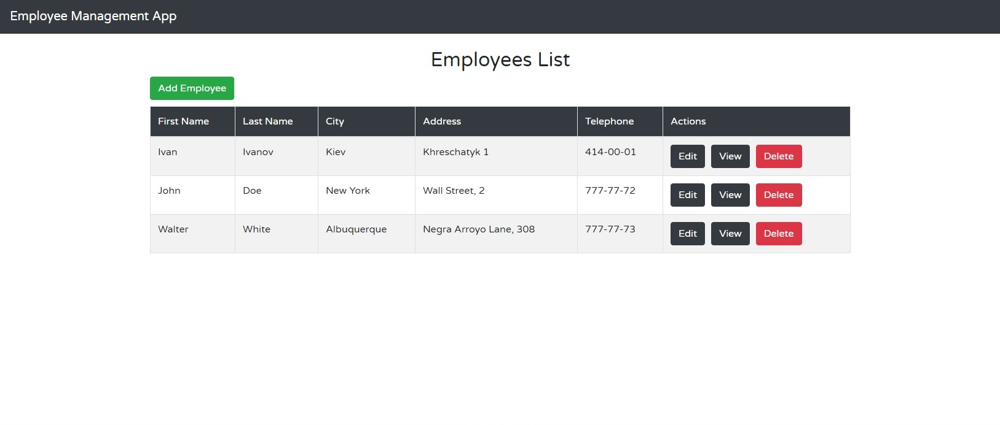

# spring-boot-reactjs-crud-app

This CRUD full-stack employee management application.
#### An actual version of build is deployed on AWS:
http://employeeweb.tk

### Used Technologies:

Component         | Technology
---               | ---
Backend           | Spring: Boot, Data
Frontend          | React.js, Redux, Bootstrap
Database          | PostgreSQL
Persistence       | JPA 
Client Build      | npm, yarn, webpack
Server Build      | Maven

## Getting Started

### Backend
- Go to your project folder and run SpringBootApplication.
- The server will start on port 8080.

### Frontend
- Go to your project folder from your terminal `cd react-frontend`
- Run: `npm install` or `yarn install`
- After install, run: `npm run start` or `yarn start`
- Open your browser (http://localhost:3000)

## Screenshots

### Employee List

### Add Employee

### Edit Employee

